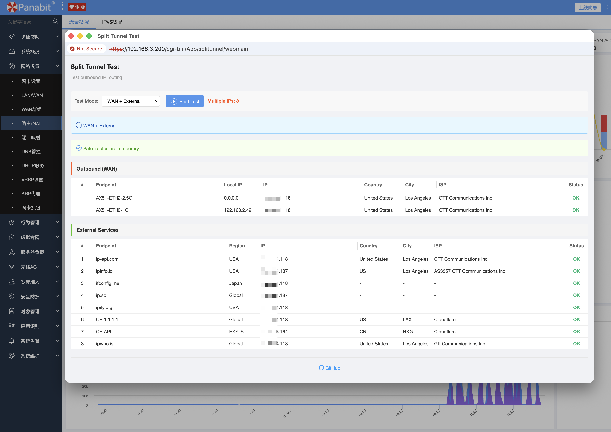

# Split Tunnel Test Addon for Panabit

## Overview

Split Tunnel Test is a comprehensive addon for Panabit that allows you to test and verify your routing policies by checking IP addresses used for different outbound paths. This addon is particularly useful for:

- Testing split tunneling configurations
- Verifying VPN routing policies
- Checking NAT proxy assignments
- Debugging routing issues
- Monitoring multi-WAN setups

## Screenshot



## Features

### Core Features
- **Multi-endpoint testing**: Tests 10 different endpoints simultaneously
- **IP address detection**: Shows the IP address used for each request
- **Geolocation info**: Displays country, city, and ISP information
- **Routing diagnostics**: Shows system routing information
- **DNS resolution test**: Tests domain resolution across different paths
- **Local IP display**: Shows all local interface IP addresses

### Advanced Features
- **Modern UI**: Clean, responsive web interface
- **Visual comparison**: Highlights IP differences for easy analysis
- **Detailed logging**: Logs all tests for troubleshooting
- **Fast testing**: Optimized for quick results

## Installation

### Method 1: Manual Installation

```bash
# Copy addon to Panabit app directory
cp -r ~/addons/split_tunnel /usr/panabit/app/

# Set permissions
chmod -R 755 /usr/panabit/app/split_tunnel
chmod +x /usr/panabit/app/split_tunnel/appctrl
chmod +x /usr/panabit/app/split_tunnel/web/cgi/*

# Start the addon
/usr/panabit/app/split_tunnel/appctrl start

# Enable the addon
/usr/panabit/app/split_tunnel/appctrl enable
```

### Method 2: Using Panabit App Control

```bash
# If appctrl is in your PATH
appctrl start split_tunnel
```

### Method 3: Using the installation script

```bash
cd ~/addons/split_tunnel
chmod +x install.sh
./install.sh
```

## Usage

### Web Interface

1. Access the Panabit web interface at `https://<panabit-ip>/`
2. Navigate to **App** menu
3. Click **Split Tunnel** (分流测试)
4. Click **Start Test** to begin testing

### Command Line

```bash
# Quick test from command line
/usr/panabit/app/split_tunnel/bin/quick_test.sh
```

### Test Endpoints

The addon tests the following endpoints by default:
- `0.ip.skk.moe` through `9.ip.skk.moe`

These endpoints are designed to help identify which outbound path is used for each request.

## Configuration

Edit `/usr/panabit/app/split_tunnel/conf/splitunnel.conf` to customize:

```bash
# Test endpoints
PRIMARY_ENDPOINTS="0.ip.skk.moe 1.ip.skk.moe ..."

# Timeout settings
TEST_TIMEOUT=5
CONNECT_TIMEOUT=3

# Logging
LOG_ENABLED=1
LOG_FILE=/usr/panabit/data/split_tunnel/test.log
```

## Understanding Results

### Split Tunnel Detection

- **All same IP**: No split tunneling detected. All traffic uses the same outbound path.
- **Different IPs**: Split tunneling detected! Different requests use different outbound paths.

### Color Coding

- **Green background**: All IPs are the same
- **Yellow background**: IPs differ, split tunneling may be active

### Status Indicators

- ✓ **Success**: Test completed successfully
- ✗ **Error/Timeout**: Test failed or endpoint unreachable

## Web API

### Test Split Tunnel
```
GET /cgi-bin/App/split_tunnel/ajax_splitunnel?action=test
```

Response:
```json
[
  {
    "endpoint": "0.ip.skk.moe",
    "ip": "1.2.3.4",
    "country": "US",
    "city": "Los Angeles",
    "isp": "Example ISP"
  }
]
```

### Test Domain Resolution
```
GET /cgi-bin/App/split_tunnel/ajax_splitunnel?action=domains
```

### Get Routing Info
```
GET /cgi-bin/App/split_tunnel/ajax_splitunnel?action=routing
```

### Get Local IPs
```
GET /cgi-bin/App/split_tunnel/ajax_splitunnel?action=interfaces
```

### Test Single Endpoint
```
GET /cgi-bin/App/split_tunnel/ajax_splitunnel?action=test_single&endpoint=0.ip.skk.moe
```

## File Structure

```
/usr/panabit/app/split_tunnel/
├── app.inf                      # Addon metadata
├── appctrl                      # Control script
├── app.png                      # Addon icon (to be added)
├── bin/
│   └── quick_test.sh           # Command-line test script
├── conf/
│   └── splitunnel.conf         # Configuration file
├── lib/
│   └── helper.sh               # Helper functions
└── web/
    ├── cgi/
    │   ├── webmain             # Main web interface
    │   └── ajax_splitunnel     # AJAX API handler
    └── html/
        ├── css/
        │   └── style.css       # Styles
        └── js/
            └── splitunnel.js   # JavaScript logic
```

## Troubleshooting

### Addon not appearing in web UI

```bash
# Check if addon is installed
ls -la /usr/panabit/app/split_tunnel/

# Verify permissions
chmod +x /usr/panabit/app/split_tunnel/appctrl
chmod +x /usr/panabit/app/split_tunnel/web/cgi/*

# Restart addon
/usr/panabit/app/split_tunnel/appctrl stop
/usr/panabit/app/split_tunnel/appctrl start

# Check if files are deployed
ls -la /usr/ramdisk/admin/cgi-bin/App/split_tunnel/
```

### Tests showing timeout

- Check internet connectivity
- Verify DNS resolution is working
- Increase timeout in configuration
- Check firewall rules

### Permission denied errors

```bash
chmod -R 755 /usr/panabit/app/split_tunnel
chmod +x /usr/panabit/app/split_tunnel/appctrl
chmod +x /usr/panabit/app/split_tunnel/web/cgi/*
chmod +x /usr/panabit/app/split_tunnel/bin/*
```

## Requirements

- Panabit system (any recent version)
- `curl` command-line tool
- `jq` (optional, for JSON processing)
- Internet connectivity
- Web browser with JavaScript enabled

## Version History

### v1.0 (2026-03-11)
- Initial release
- Multi-endpoint testing
- Web interface
- Command-line tool
- API endpoints


## License

This addon is provided as-is for educational and diagnostic purposes.

## Support

For issues and feature requests, please check:
- Panabit documentation
- System logs: `/var/log/messages`
- Addon logs: `/usr/panabit/data/split_tunnel/test.log`

---

**Note**: This addon is designed for network diagnostics and testing purposes only. Always ensure you have proper authorization before testing network configurations.
